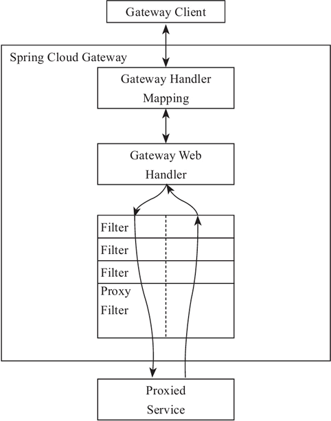

# Spring Cloud Gateway 核心概念和工作原理

Spring Cloud Gateway 是 Spring 官方基于 Spring 5.0、Spring Boot 2.0 和 Project Reactor 等技术开发的网关，Spring Cloud Gateway 旨在为微服务架构提供一种简单有效的、统一的 API 路由管理方式。

Spring Cloud Gateway 作为 Spring Cloud 生态系中的网关，其目标是替代 Netflix Zuul，它不仅提供统一的路由方式，并且基于 Filter 链的方式提供了网关基本的功能，例如：安全、监控/埋点和限流等。

Spring Cloud Gateway 依赖 Spring Boot 和 Spring WebFlux，基于 Netty 运行。它不能在传统的 servlet 容器中工作，也不能构建成 war 包。

在 Spring Cloud Gateway 中有如下几个核心概念需要我们了解：

1. Route

Route 是网关的基础元素，由 ID、目标 URI、断言、过滤器组成。当请求到达网关时，由 Gateway Handler Mapping 通过断言进行路由匹配（Mapping），当断言为真时，匹配到路由。

2. Predicate

Predicate 是 Java 8 中提供的一个函数。输入类型是 Spring Framework ServerWebExchange。它允许开发人员匹配来自 HTTP 的请求，例如请求头或者请求参数。简单来说它就是匹配条件。

3. Filter

Filter 是 Gateway 中的过滤器，可以在请求发出前后进行一些业务上的处理。

## 工作原理

Spring Cloud Gateway 的工作原理跟 Zuul 的差不多，最大的区别就是 Gateway 的 Filter 只有 pre 和 post 两种。下面我们简单了解一下 Gateway 的工作原理图，如图 1 所示。



图 1 Spring Cloud Gateway 工作原理

客户端向 Spring Cloud Gateway 发出请求，如果请求与网关程序定义的路由匹配，则该请求就会被发送到网关 Web 处理程序，此时处理程序运行特定的请求过滤器链。

过滤器之间用虚线分开的原因是过滤器可能会在发送代理请求的前后执行逻辑。所有 pre 过滤器逻辑先执行，然后执行代理请求；代理请求完成后，执行 post 过滤器逻辑。

## 整合Eureka路由转发

本节我们先创建一个 Gateway 项目，然后实现了一个最简单的转发功能，并进行 Eureka 路由的整合。

### 创建 Gateway 项目

创建一个 Spring Boot 的 Maven 项目，增加 Spring Cloud Gateway 的依赖，代码如下所示。

```xml
<parent>
    <groupId>org.springframework.boot</groupId>
    <artifactId>spring-boot-starter-parent</artifactId>
    <version>2.0.6.RELEASE</version>
    <relativePath />
</parent>
<dependencyManagement>
    <dependencies>
        <dependency>
            <groupId>org.springframework.cloud</groupId>
            <artifactId>spring-cloud-dependencies</artifactId>
            <version>Finchley.SR2</version>
            <type>pom</type>
            <scope>import</scope>
        </dependency>
    </dependencies>
</dependencyManagement>
<dependencies>
    <dependency>
        <groupId>org.springframework.cloud</groupId>
        <artifactId>spring-cloud-starter-gateway</artifactId>
    </dependency>
</dependencies>
```

启动类就按 Spring Boot 的方式即可，无须添加额外的注解。代码如下所示。

```java
@SpringBootApplication
public class App {
    public static void main(String[] args) {
        SpringApplication.run(App.class, args);
    }
}
```

### 路由转发示例

下面来实现一个最简单的转发功能——基于 Path 的匹配转发功能。

Gateway 的路由配置对 yml 文件支持比较好，我们在 resources 下建一个 application.yml 的文件，内容如下：

```yaml
server:
  port: 2001
spring:
  cloud:
    gateway:
      routes:
        - id: path_route
          uri: http://c.biancheng.net
          predicates:
            - Path=/spring_cloud
```

当你访问 http://localhost:2001/spring_cloud 的时候就会转发到 http://c.biancheng.net/spring_cloud。

如果我们要支持多级 Path，配置方式跟 Zuul 中一样，在后面加上两个`*`号即可，比如：

```yaml
- id: path_route2
  uri: http://c.biancheng.net
  predicates:
    - Path=/spring_cloud/**
```

这样一来，上面的配置就可以支持多级 Path，比如访问 http://localhost:2001/spring_cloud/view/1 的时候就会转发到 http://c.biancheng.net/spring_cloud/view/1。

### 整合 Eureka 路由

添加 Eureka Client 的依赖，代码如下所示。

```xml
<dependency>
    <groupId>org.springframework.cloud</groupId>
    <artifactId>spring-cloud-starter-netflix-eureka-client</artifactId>
</dependency>
```

配置基于 Eureka 的路由：

```yaml
- id: user-service
  uri: lb://user-service
  predicates:
    - Path=/user-service/**
```

uri 以`lb：//`开头（lb 代表从注册中心获取服务），后面接的就是你需要转发到的服务名称，这个服务名称必须跟 Eureka 中的对应，否则会找不到服务，错误代码如下：

```txt
org.springframework.cloud.gateway.support.NotFoundException: Unable to find instance for user-service1
```

### 整合 Eureka 的默认路由

Zuul 默认会为所有服务都进行转发操作，我们只需要在访问路径上指定要访问的服务即可，通过这种方式就不用为每个服务都去配置转发规则，当新加了服务的时候，不用去配置路由规则和重启网关。

在 Spring Cloud Gateway 中当然也有这样的功能，通过配置即可开启，配置如下：

```yaml
spring:
  cloud:
    gateway:
      discovery:
        locator:
          enabled: true
```

开启之后我们就可以通过地址去访问服务了，格式如下：

```txt
http://网关地址/服务名称(大写)/**
http://localhost:2001/USER-SERVICE/user/get?id=1
```

这个大写的名称还是有很大的影响，如果我们从 Zuul 升级到 Spring Cloud Gateway 的话意味着请求地址有改变，或者重新配置每个服务的路由地址，通过源码笔者发现可以做到兼容处理，再增加一个配置即可：

```yaml
spring:
  cloud:
    gateway:
      discovery:
        locator:
          lowerCaseServiceId: true
```

配置完成之后我们就可以通过小写的服务名称进行访问了，如下所示：

```tex
http://网关地址/服务名称(小写)/**
http://localhost:2001/user-service/user/get?id=1
```

注意：开启小写服务名称后大写的服务名称就不能使用，两者只能选其一。

配置源码在 org.springframework.cloud.gateway.discovery.DiscoveryLocatorProperties 类中，代码所示。

```java
@ConfigurationProperties("spring.cloud.gateway.discovery.locator")
public class DiscoveryLocatorProperties {
    /**
     * 服务名称小写配置, 默认为false
     *
     */
    private boolean lowerCaseServiceId = false;
}
```

## 路由断言工厂

Spring Cloud Gateway 内置了许多路由断言工厂，可以通过配置的方式直接使用，也可以组合使用多个路由断言工厂。接下来为大家介绍几个常用的路由断言工厂类。

1. Path 路由断言工厂

Path 路由断言工厂接收一个参数，根据 Path 定义好的规则来判断访问的 URI 是否匹配。

```yaml
spring:
  cloud:
    gateway:
      routes:
        - id: host_route
          uri: http://c.biancheng.net
          predicates:
            - Path=/blog/detail/{segment}
```

如果请求路径为 /blog/detail/xxx，则此路由将匹配。也可以使用正则，例如 /blog/detail/** 来匹配 /blog/detail/ 开头的多级 URI。

我们访问本地的网关：http://localhost:2001/blog/detail/36185 ，可以看到显示的是 http://c.biancheng.net/blog/detail/36185 对应的内容。

2. Query 路由断言工厂

Query 路由断言工厂接收两个参数，一个必需的参数和一个可选的正则表达式。

```yaml
spring:
  cloud:
    gateway:
      routes:
        - id: query_route
          uri: http://c.biancheng.net
          predicates:
            - Query=foo, ba.
```

如果请求包含一个值与 ba 匹配的 foo 查询参数，则此路由将匹配。bar 和 baz 也会匹配，因为第二个参数是正则表达式。

测试链接：http://localhost:2001/?foo=baz。

3. Method 路由断言工厂

Method 路由断言工厂接收一个参数，即要匹配的 HTTP 方法。

```yaml
spring:
  cloud:
    gateway:
      routes:
        - id: method_route
          uri: http://baidu.com
          predicates:
            - Method=GET
```

4. Header 路由断言工厂

Header 路由断言工厂接收两个参数，分别是请求头名称和正则表达式。

```yaml
spring:
  cloud:
    gateway:
      routes:
        - id: header_route
          uri: http://example.org
          predicates:
            - Header=X-Request-Id, \d+
```

如果请求中带有请求头名为 x-request-id，其值与 \d+ 正则表达式匹配（值为一个或多个数字），则此路由匹配。

如果你想学习更多路由断言工厂的用法，可以参考官方文档进行学习。

### 自定义路由断言工厂

自定义路由断言工厂需要继承 AbstractRoutePredicateFactory 类，重写 apply 方法的逻辑。

在 apply 方法中可以通过 exchange.getRequest() 拿到 ServerHttpRequest 对象，从而可以获取到请求的参数、请求方式、请求头等信息。

apply 方法的参数是自定义的配置类，在使用的时候配置参数，在 apply 方法中直接获取使用。

命名需要以 RoutePredicateFactory 结尾，比如 CheckAuthRoutePredicateFactory，那么在使用的时候 CheckAuth 就是这个路由断言工厂的名称。代码如下所示。

```java
@Component
public class CheckAuthRoutePredicateFactory
        extends AbstractRoutePredicateFactory<CheckAuthRoutePredicateFactory.Config> {
    public CheckAuthRoutePredicateFactory() {
        super(Config.class);
    }
    @Override
    public Predicate<ServerWebExchange> apply(Config config) {
        return exchange -> {
            System.err.println("进入了CheckAuthRoutePredicateFactory\t" + config.getName());
            if (config.getName().equals("zhangsan")) {
                return true;
            }
            return false;
        };
    }
    public static class Config {
        private String name;
        public void setName(String name) {
            this.name = name;
        }
        public String getName() {
            return name;
        }
    }
}
```

使用示例如下所示：

```yaml
spring:
  cloud:
    gateway:
      routes:
        - id: customer_route
          uri: http://c.biancheng.net
          predicates:
          - name: CheckAuth
          args:
          name: zhangsan
```

## 过滤器工厂

GatewayFilter Factory 是 Spring Cloud Gateway 中提供的过滤器工厂。Spring Cloud Gateway 的路由过滤器允许以某种方式修改传入的 HTTP 请求或输出的 HTTP 响应，只作用于特定的路由。

Spring Cloud Gateway 中内置了很多过滤器工厂，直接采用配置的方式使用即可，同时也支持自定义 GatewayFilter Factory 来实现更复杂的业务需求。

```yaml
spring:
  cloud:
    gateway:
      routes:
        - id: add_request_header_route
          uri: http://c.biancheng.net
          filters:
            - AddRequestHeader=X-Request-Foo, Bar
```

接下来为大家介绍几个常用的过滤器工厂类。

#### 1. AddRequestHeader 过滤器工厂

通过名称我们可以快速明白这个过滤器工厂的作用是添加请求头。

符合规则匹配成功的请求，将添加 X-Request-Foo：bar 请求头，将其传递到后端服务中，后方服务可以直接获取请求头信息。代码如下所示。

```java
@GetMapping("/hello")
public String hello(HttpServletRequest request) throws Exception {
    System.err.println(request.getHeader("X-Request-Foo"));
    return "success";
}
```

#### 2. RemoveRequestHeader 过滤器工厂

RemoveRequestHeader 是移除请求头的过滤器工厂，可以在请求转发到后端服务之前进行 Header 的移除操作。

```yaml
spring:
  cloud:
    gateway:
      routes:
        - id: removerequestheader_route
          uri: http://c.biancheng.net
            - RemoveRequestHeader=X-Request-Foo
```

#### 3. SetStatus 过滤器工厂

SetStatus 过滤器工厂接收单个状态，用于设置 Http 请求的响应码。它必须是有效的 Spring Httpstatus（org.springframework.http.HttpStatus）。它可以是整数值 404 或枚举类型 NOT_FOUND。

```yaml
spring:
  cloud:
    gateway:
      routes:
        - id: setstatusint_route
          uri: http://c.biancheng.net
          filters:
            - SetStatus=401
```

#### 4. RedirectTo过滤器工厂

RedirectTo 过滤器工厂用于重定向操作，比如我们需要重定向到百度。

```yaml
spring:
  cloud:
    gateway:
      routes:
        - id: prefixpath_route
          uri: http://c.biancheng.net
          filters:
            - RedirectTo=302, http://baidu.com
```

以上为大家介绍了几个过滤器工厂的使用，教程后面还会为大家介绍 Retry 重试、RequestRateLimiter 限流、Hystrix 熔断过滤器工厂等内容，其他的大家可以自行参考官方文档进行学习。

### 自定义过滤器工厂

自定义 Spring Cloud Gateway 过滤器工厂需要继承 AbstractGatewayFilterFactory 类，重写 apply 方法的逻辑。命名需要以 GatewayFilterFactory 结尾，比如 CheckAuthGatewayFilterFactory，那么在使用的时候 CheckAuth 就是这个过滤器工厂的名称。

自定义过滤器工厂代码如下所示。

```java
@Component
public class CheckAuth2GatewayFilterFactory
        extends AbstractGatewayFilterFactory<CheckAuth2GatewayFilterFactory.Config> {
    public CheckAuth2GatewayFilterFactory() {
        super(Config.class);
    }
    @Override
    public GatewayFilter apply(Config config) {
    return (exchange, chain) -> {
      System.err.println("进入了CheckAuth2GatewayFilterFactory" + config.getName());
      ServerHttpRequest request = exchange.getRequest().mutate()
      .build();
      return
      chain.filter(exchange.mutate().request(request).build());
    }
  }
    public static class Config {
        private String name;
        public void setName(String name) {
            this.name = name;
        }
        public String getName() {
            return name;
        }
    }
}
```

使用如下：

```yaml
filters:
  - name: CheckAuth2
  args:
    name: 张三
```

如果你的配置是 Key、Value 这种形式的，那么可以不用自己定义配置类，直接继承 AbstractNameValueGatewayFilterFactory 类即可。

AbstractNameValueGatewayFilterFactory 类继承了 AbstractGatewayFilterFactory，定义了一个 NameValueConfig 配置类，NameValueConfig 中有 name 和 value 两个字段。

我们可以直接使用，AddRequestHeaderGatewayFilterFactory、AddRequestParameterGatewayFilterFactory 等都是直接继承的 AbstractNameValueGatewayFilterFactory。

继承 AbstractNameValueGatewayFilterFactory 方式定义过滤器工厂，代码如下所示。

```java
@Component
public class CheckAuthGatewayFilterFactory extends AbstractNameValueGatewayFilter-actory {
    @Override
    public GatewayFilter apply(NameValueConfig config) {
        return (exchange, chain) -> {
            System.err.println("进入了CheckAuthGatewayFilterFactory" + config.getName() + "\t" + config.getValue());
            ServerHttpRequest request = exchange.getRequest().mutate().build();
            return chain.filter(exchange.mutate().request(request).build());
        };
    }
}
```

使用如下：

```yaml
filters：
	- CheckAuth=zhangsan,男
```

## 全局过滤器（GlobalFilter）

全局过滤器作用于所有的路由，不需要单独配置，我们可以用它来实现很多统一化处理的业务需求，比如权限认证、IP 访问限制等。

接口定义类 org.springframework.cloud.gateway.filter.GlobalFilter，具体代码如下所示。

```java
public interface GlobalFilter {
    Mono<Void> filter(ServerWebExchange exchange, GatewayFilterChain chain);
}
```

Spring Cloud Gateway 自带的 GlobalFilter 实现类有很多。

有转发、路由、负载等相关的 GlobalFilter，感兴趣的朋友可以去看下源码自行了解。我们如何通过定义 GlobalFilter 来实现我们的业务逻辑？

这里给出一个官方文档上的案例，代码如下所示。

```java
@Configuration
public class ExampleConfiguration {
    private Logger log = LoggerFactory.getLogger(ExampleConfiguration.class);
    @Bean
    @Order(-1)
    public GlobalFilter a() {
        return (exchange, chain) -> {
            log.info("first pre filter");
            return chain.filter(exchange).then(Mono.fromRunnable(() -> {
                log.info("third post filter");
            }));
        };
    }
    @Bean
    @Order(0)
    public GlobalFilter b() {
        return (exchange, chain) -> {
            log.info("second pre filter");
            return chain.filter(exchange).then(Mono.fromRunnable(() -> {
                log.info("second post filter");
            }));
        };
    }
    @Bean
    @Order(1)
    public GlobalFilter c() {
        return (exchange, chain) -> {
            log.info("third pre filter");
            return chain.filter(exchange).then(Mono.fromRunnable(() -> {
                log.info("first post filter");
            }));
        };
    }
}
```

上面定义了 3 个 GlobalFilter，通过 @Order 来指定执行的顺序，数字越小，优先级越高。

当 GlobalFilter 的逻辑比较多时，笔者还是推荐大家单独写一个 GlobalFilter 来处理，比如我们要实现对 IP 的访问限制，即不在 IP 白名单中就不能调用的需求。

单独定义只需要实现 GlobalFilter、Ordered 两个接口就可以了，具体代码如下所示。

```java
@Component
public class IPCheckFilter implements GlobalFilter, Ordered {
    @Override
    public int getOrder() {
        return 0;
    }
    @Override
    public Mono<Void> filter(ServerWebExchange exchange, GatewayFilterChain chain) {
        HttpHeaders headers = exchange.getRequest().getHeaders();
        // 此处写得非常绝对, 只作演示用, 实际中需要采取配置的方式
        if (getIp(headers).equals("127.0.0.1")) {
            ServerHttpResponse response = exchange.getResponse();
            ResponseData data = new ResponseData();
            data.setCode(401);
            data.setMessage("非法请求");
            byte[] datas = JsonUtils.toJson(data).getBytes(StandardCharsets.UTF_8);
            DataBuffer buffer = response.bufferFactory().wrap(datas);
            response.setStatusCode(HttpStatus.UNAUTHORIZED);
            response.getHeaders().add("Content-Type", "application/json;charset=UTF-8");
            return response.writeWith(Mono.just(buffer));
        }
        return chain.filter(exchange);
    }
    // 这里从请求头中获取用户的实际IP,根据Nginx转发的请求头获取
    private String getIp(HttpHeaders headers) {
        return "127.0.0.1";
    }
}
```

过滤的使用虽然比较简单，但作用很大，可以处理很多需求，上面讲的 IP 认证拦截只是冰山一角，更多的功能需要我们自己基于过滤器去实现。

## 限流

开发高并发系统时有三把利器用来保护系统：缓存、降级和限流。API 网关作为所有请求的入口，请求量大，我们可以通过对并发访问的请求进行限速来保护系统的可用性。

目前限流提供了基于 Redis 的实现，我们需要增加对应的依赖，代码如下所示。

```xml
<dependency>
    <groupId>org.springframework.boot</groupId>
    <artifactId>spring-boot-starter-data-redis-reactive</artifactId>
</dependency>
```

我们可以通过 KeyResolver 来指定限流的 Key，比如我们需要根据用户来做限流，或是根据 IP 来做限流等。

#### 1. IP 限流

IP 限流的 Key 指定具体代码如下所示。

```java
@Bean
public KeyResolver ipKeyResolver() {
    return exchange -> Mono.just(exchange.getRequest().getRemoteAddress().getHostName());
}
public static String getIpAddr(ServerHttpRequest request) {
    HttpHeaders headers = request.getHeaders();
    List<String> ips = headers.get("X-Forwarded-For");
    String ip = "192.168.1.1";
    if (ips != null && ips.size() > 0) {
        ip = ips.get(0);
    }
    return ip;
}
```

#### 2. 用户限流

根据用户来做限流只需要获取当前请求的用户 ID 或者用户名，代码如下所示。

```java
@Bean
KeyResolver userKeyResolver() {
    return exchange ->
        Mono.just(exchange.getRequest().getQueryParams().getFirst("userId"));
}
```

#### 3. 接口限流

获取请求地址的 uri 作为限流 Key，代码如下所示。

```java
@Bean
KeyResolver apiKeyResolver() {
    return exchange ->
        Mono.just(exchange.getRequest().getPath().value());
}
```

然后配置限流的过滤器信息：

```yaml
server:
  port: 8084
spring:
  redis:
    host: 127.0.0.1
    port: 6379
  cloud:
    gateway:
  routes:
    - id: fsh-house
      uri: lb://fsh-house
      predicates:
        - Path=/house/**
      filters:
        - name: RequestRateLimiter
      args:
        redis-rate-limiter.replenishRate: 10
        redis-rate-limiter.burstCapacity: 20
        key-resolver: "#{@ipKeyResolver}"
```

> - filter 名称必须是 RequestRateLimiter。
> - redis-rate-limiter.replenishRate：允许用户每秒处理多少个请求。
> - redis-rate-limiter.burstCapacity：令牌桶的容量，允许在 1s 内完成的最大请求数。
> - key-resolver：使用 SpEL 按名称引用 bean。

可以访问接口进行测试，这时候 Redis 中会有对应的数据：

```txt
127.0.0.1:6379> keys *
1) "request_rate_limiter.{localhost}.timestamp"
2) "request_rate_limiter.{localhost}.tokens"
```

> 大括号中就是我们的限流 Key，这里是 IP，本地的就是 localhost。
>
> - timestamp：存储的是当前时间的秒数，也就是 System.currentTimeMillis()/1000 或者 Instant.now().getEpochSecond()。
> - tokens：存储的是当前这秒钟对应的可用令牌数量。

## 熔断回退

在 Spring Cloud Gateway 中使用 Hystrix 进行回退需要增加 Hystrix 的依赖，代码如下所示。

```xml
<dependency>
    <groupId>org.springframework.cloud</groupId>
    <artifactId>spring-cloud-starter-netflix-hystrix</artifactId>
</dependency>
```

内置了 HystrixGatewayFilterFactory 来实现路由级别的熔断，只需要配置即可实现熔断回退功能。配置方式如下所示。

```yaml
- id: user-service
    uri: lb://user-service
    predicates:
      - Path=/user-service/**
    filters:
      - name: Hystrix
    args:
      name: fallbackcmd
    fallbackUri: forward:/fallback
```

上面配置了一个 Hystrix 过滤器，该过滤器会使用 Hystrix 熔断与回退，原理是将请求包装成 RouteHystrixCommand 执行，RouteHystrixCommand 继承于 com.netflix.hystrix.HystrixObservableCommand。

fallbackUri 是发生熔断时回退的 URI 地址，目前只支持 forward 模式的 URI。如果服务被降级，该请求会被转发到该 URI 中。

在网关中创建一个回退的接口，用于熔断时处理返回给调用方的信息，代码如下所示。

```java
@RestController
public class FallbackController {
    @GetMapping("/fallback")
    public String fallback() {
        return "fallback";
    }
}
```

## 跨域

在 Spring Cloud Gateway 中配置跨域有两种方式，分别是代码配置方式和配置文件方式。

代码配置方式配置跨域，具体代码如下所示。

```java
@Configuration
public class CorsConfig {
    @Bean
    public WebFilter corsFilter() {
        return (ServerWebExchange ctx, WebFilterChain chain) -> {
            ServerHttpRequest request = ctx.getRequest();
            if (CorsUtils.isCorsRequest(request)) {
                HttpHeaders requestHeaders = request.getHeaders();
                ServerHttpResponse response = ctx.getResponse();
                HttpMethod requestMethod = requestHeaders.getAccessControlRequestMethod();
                HttpHeaders headers = response.getHeaders();
                headers.add(HttpHeaders.ACCESS_CONTROL_ALLOW_ORIGIN, requestHeaders.getOrigin());
                headers.addAll(HttpHeaders.ACCESS_CONTROL_ALLOW_HEADERS,
                        requestHeaders.getAccessControlRequestHeaders());
                if (requestMethod != null) {
                    headers.add(HttpHeaders.ACCESS_CONTROL_ALLOW_METHODS, requestMethod.name());
                }
                headers.add(HttpHeaders.ACCESS_CONTROL_ALLOW_CREDENTIALS, "true");
                headers.add(HttpHeaders.ACCESS_CONTROL_EXPOSE_HEADERS, "*");
                if (request.getMethod() == HttpMethod.OPTIONS) {
                    response.setStatusCode(HttpStatus.OK);
                    return Mono.empty();
                }
            }
            return chain.filter(ctx);
        };
    }
}
```

配置文件方式配置跨域：

```yaml
spring:
  cloud:
    gateway:
      globalcors:
        corsConfigurations:
          '[/**]':
            allowedOrigins: "*"
            exposedHeaders:
              - content-type
            allowedHeaders:
              - content-type
            allowCredentials: true
              allowedMethods:
              - GET
              - OPTIONS
              - PUT
              - DELETE
              - POST
```

## 统一异常处理

Spring Cloud Gateway 中的全局异常处理不能直接使用 @ControllerAdvice，可以通过跟踪异常信息的抛出，找到对应的源码，自定义一些处理逻辑来匹配业务的需求。

网关是给接口做代理转发的，后端对应的是 REST API，返回数据格式是 JSON。如果不做处理，当发生异常时，Gateway 默认给出的错误信息是页面，不方便前端进行异常处理。

所以我们需要对异常信息进行处理，并返回 JSON 格式的数据给客户端。下面先看实现的代码，后面再跟大家讲一下需要注意的地方。

自定义异常处理逻辑，代码如下所示。

```java
public class JsonExceptionHandler extends DefaultErrorWebExceptionHandler {
    public JsonExceptionHandler(ErrorAttributes errorAttributes, ResourceProperties resourceProperties,
            ErrorProperties errorProperties, ApplicationContext applicationContext) {
        super(errorAttributes, resourceProperties, errorProperties, applicationContext);
    }
    /**
     * 获取异常属性
     */
    @Override
    protected Map<String, Object> getErrorAttributes(ServerRequest request, boolean includeStackTrace) {
        int code = 500;
        Throwable error = super.getError(request);
        if (error instanceof org.springframework.cloud.gateway.support.NotFoundException) {
            code = 404;
        }
        return response(code, this.buildMessage(request, error));
    }
    /**
     * 指定响应处理方法为JSON处理的方法
     *
     * @param errorAttributes
     */
    @Override
    protected RouterFunction<ServerResponse> getRoutingFunction(ErrorAttributes errorAttributes) {
        return RouterFunctions.route(RequestPredicates.all(), this::renderErrorResponse);
    }
    /**
     * 根据code获取对应的HttpStatus
     *
     * @param errorAttributes
     */
    @Override
    protected HttpStatus getHttpStatus(Map<String, Object> errorAttributes) {
        int statusCode = (int) errorAttributes.get("code");
        return HttpStatus.valueOf(statusCode);
    }
    /**
     * 构建异常信息
     *
     * @param request
     * @param ex
     * @return
     */
    private String buildMessage(ServerRequest request, Throwable ex) {
        StringBuilder message = new StringBuilder("Failed to handle request [");
        message.append(request.methodName());
        message.append(" ");
        message.append(request.uri());
        message.append("]");
        if (ex != null) {
            message.append(": ");
            message.append(ex.getMessage());
        }
        return message.toString();
    }
    /**
     * 构建返回的JSON数据格式
     *
     * @param status       状态码
     * @param errorMessage 异常信息
     * @return
     */
    public static Map<String, Object> response(int status, String errorMessage) {
        Map<String, Object> map = new HashMap<>();
        map.put("code", status);
        map.put("message", errorMessage);
        map.put("data", null);
        return map;
    }
}
```

覆盖默认的配置，代码如下所示。

```java
@Configuration
@EnableConfigurationProperties({ ServerProperties.class, ResourceProperties.class })
public class ErrorHandlerConfiguration {
    private final ServerProperties serverProperties;
    private final ApplicationContext applicationContext;
    private final ResourceProperties resourceProperties;
    private final List<ViewResolver> viewResolvers;
    private final ServerCodecConfigurer serverCodecConfigurer;
    public ErrorHandlerConfiguration(ServerProperties serverProperties, ResourceProperties resourceProperties,
            ObjectProvider<List<ViewResolver>> viewResolversProvider, ServerCodecConfigurer serverCodecConfigurer,
            ApplicationContext applicationContext) {
        this.serverProperties = serverProperties;
        this.applicationContext = applicationContext;
        this.resourceProperties = resourceProperties;
        this.viewResolvers = viewResolversProvider.getIfAvailable(Collections::emptyList);
        this.serverCodecConfigurer = serverCodecConfigurer;
    }
    @Bean
    @Order(Ordered.HIGHEST_PRECEDENCE)
    public ErrorWebExceptionHandler errorWebExceptionHandler(ErrorAttributes errorAttributes) {
        JsonExceptionHandler exceptionHandler = new JsonExceptionHandler(errorAttributes, 
            this.resourceProperties,this.serverProperties.getError(), this.applicationContext);
        exceptionHandler.setViewResolvers(this.viewResolvers);
        exceptionHandler.setMessageWriters(this.serverCodecConfigurer.getWriters());
        exceptionHandler.setMessageReaders(this.serverCodecConfigurer.getReaders());
        return exceptionHandler;
    }
}
```

#### 1. 异常时返回 JSON

在 `org.springframework.boot.autoconfigure.web.reactive.error.DefaultErrorWeb-Exception-Handler` 中的 `getRoutingFunction() `方法就是控制返回格式的，源代码如下所示。

```java
@Override
protected RouterFunction<ServerResponse> getRoutingFunction(ErrorAttributes errorAttributes) {
    return RouterFunctions.route(acceptsTextHtml(), this::renderErrorView).andRoute(RequestPredicates.all(), this::renderErrorResponse);
}
```

这里优先是用 HTML 来显示的，如果想用 JSON 显示改动就可以了，具体代码如下所示。

```java
protected RouterFunction<ServerResponse> getRoutingFunction(ErrorAttributes errorAttributes) {
    return RouterFunctions.route(RequestPredicates.all(),this::renderErrorResponse);
}
```

#### 2. getHttpStatus 重写

原始的方法是通过 status 来获取对应的 HttpStatus 的，具体代码如下所示。

```java
protected HttpStatus getHttpStatus(Map<String, Object> errorAttributes) {
    int statusCode = (int) errorAttributes.get("status");
    return HttpStatus.valueOf(statusCode);
}
```

如果我们定义的格式中没有 status 字段的话，就会报错，因为找不到对应的响应码。要么返回数据格式中增加 status 子段，要么重写，在笔者的操作中返回的是 code，所以要重写，代码如下所示。

```java
@Override
protected HttpStatus getHttpStatus(Map<String, Object> errorAttributes) {
    int statusCode = (int) errorAttributes.get("code");
    return HttpStatus.valueOf(statusCode);
}
```

## 重试机制

RetryGatewayFilter 是 Spring Cloud Gateway 对请求重试提供的一个 GatewayFilter Factory。配置方式如下所示。

```yaml
spring:
  cloud:
    gateway:
      routes:
        - id: zuul-encrypt-service
          uri: lb://zuul-encrypt-service
          predicates:
            - Path=/data/**
          filters:
            - name: Retry
          args:
            retries: 3
            series: SERVER_ERROR
```

> 上述代码中具体参数含义如下所示。
>
> - retries：重试次数，默认值是 3 次。
> - series：状态码配置（分段），符合某段状态码才会进行重试逻辑，默认值是 SERVER_ERROR，值是 5，也就是 5XX（5 开头的状态码），共有 5 个值，代码如下所示。

```java
public enum Series {
    INFORMATIONAL(1), SUCCESSFUL(2), REDIRECTION(3), CLIENT_ERROR(4), SERVER_ERROR(5);
}
```

上述代码中具体参数含义如下所示。

- statuses：状态码配置，和 series 不同的是这里是具体状态码的配置，取值请参考 `org.springframework.http.HttpStatus`。
- methods：指定哪些方法的请求需要进行重试逻辑，默认值是 GET 方法，取值代码如下所示。

```java
public enum HttpMethod {
    GET, HEAD, POST, PUT, PATCH, DELETE, OPTIONS, TRACE;
}
```

上述代码中具体参数含义如下所示。 exceptions：指定哪些异常需要进行重试逻辑。默认值是 `java.io.IOException` 和 `org.springframework.cloud.gateway.support.TimeoutException`。