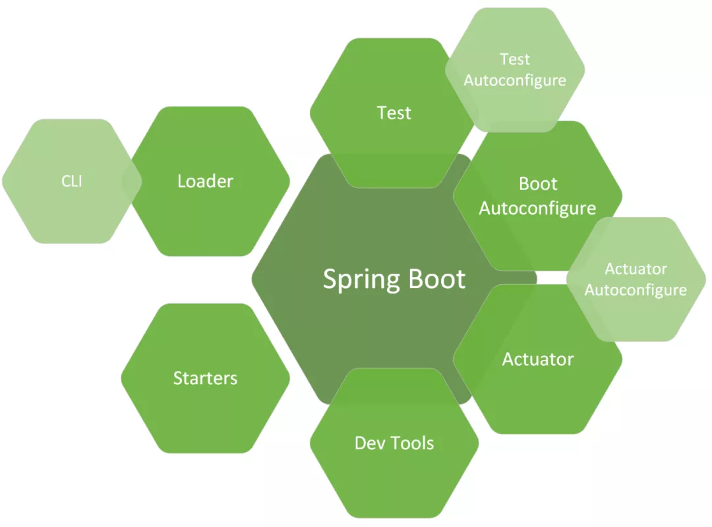
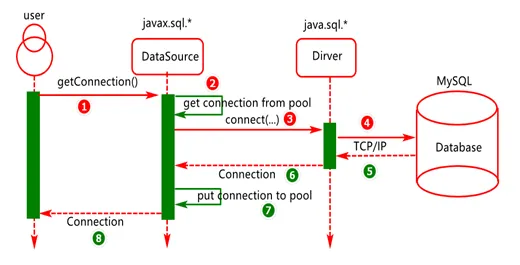
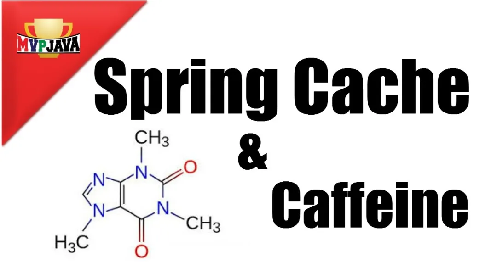
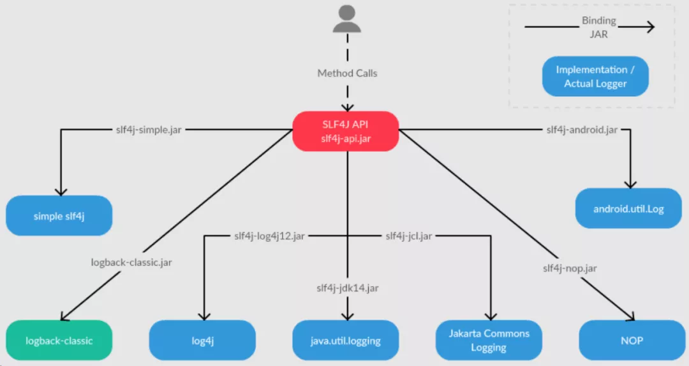
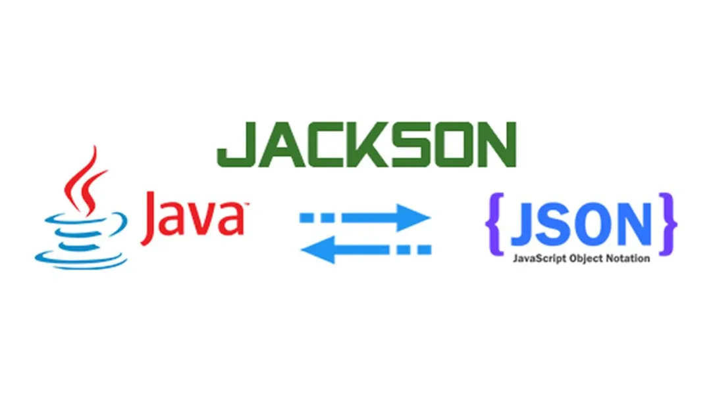
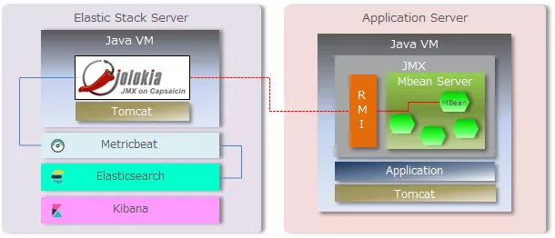

# Java 常用开源库

## 1. Netty

第一送给Netty。其实我是有私心的，也只有在使用Netty开发一些网络应用的时候，我才能理直气壮的不引入Spring这个目前变得越来越重的家伙，还我一个清清爽爽的世界。

Netty已经成为了目前最流行的Java网络编程框架。有了它，Java才有了与golang等语言相提并论的权利。

## 2. SpringBoot

在很多中小公司，Java企业级开发首选SpringBoot，这是没得说的。由于它的应用实在是太广泛，我这里就不浪费笔墨做过多介绍了。

Spring当年的目标，是为了干掉J2EE。屠龙的少年如今变成了龙，现在在干着J2EE当年做的事情。

不过，尽量的做的轻量级，一直是它的主旋律，这一点从来没有变过。因为错的不是Spring，错的是这个世界。

## 3. 工具类库

由于历史原因，apache-commons工具类库，几乎遍布了项目中的每个角落，比如lang3、beanutils、collections、codec等。个人觉得，apache-commons的很多工具，已经是过度设计了，在一些新项目里，我已经很少使用了。

取而代之的，是大量使用guava工具类库，以及国产的hutool工具类库。有了这些工具，就不用再在项目里写一些拼拼凑凑，让人难受的小工具类了。

说点有意思的事情，guava这个词朗朗上口，它的中文意思是一种热带水果：番石榴，长的就像是小西瓜一样。

## 4. 单元测试

JUnit几乎成了Java单元测试的标配。JUnit5更是对整体模块进行了重构。现在，它包含3个主要的模块：JUnit Jupiter、JUnit Platform、JUnit Vintage等。

Vintage是为了兼容比较老的版本而存在的，Platform是为了兼容其他测试引擎，这样在JUnit上使用Mockito也成为了可能。如果你的项目比较新，建议直接上Jupiter。

很多国外系统对单元测试看的比较重，这和国内的开发模式是不太一样的。虽然说，单元测试是一个程序员的基本功，但离着普及还有一段距离。不过现在也有很多公司强制要求写单元测试，以任务指标的形式存在。

## 5. JMH

JMH是最装逼，最牛逼的基准测试工具套件，主要用在性能测试方面。如果定位到了热点代码，要测试它的性能数据，评估改善情况，就可以交给 JMH。它的测量精度非常高，可达纳秒级别。

它能够消除JIT的差异，测试出真正的代码性能。JMH 已经在 JDK 12中被包含，其他版本的需要自行引入 maven。

## 6. OkHTTP

最新的JDK已经内置了HTTP的功能，但这种协议层面的东西，放在基础类库里老感觉不是那么妥当。

很长一段时间里，Apache 的HttpClient统治了世界，甚至重构后在不同版本之间不能够做到兼容。我更喜欢轻量级的OkHTTP多一些，第一次见它还是在Android的应用代码里，现在用在应用代码里也很香。OKHTTP的透明压缩，显得也更加智能一些。

像SpringCloud这样的组件，在底层是可以选择切换成HttpClient还是OkHTTP的。

应用层的协议变动都比较大，更新也比较快。比如HTTP2，Quic等支持，显然要对整个类库做很多的修改才能适配。

## 7. 数据库连接池

SpringBoot2默认选择了hikaricp作为连接池，据说是速度最快的连接池，而且代码量非常的精简。c3p0、dbcp等老旧的数据库连接池已经慢慢退位。

hikaricp非常的卷，它采用无锁化的思想，核心类库只有ConcurrentBag一个，甚至使用Javassist修改字节码来增加执行速度。

在国内，还有一个使用较为广泛的连接池是Druid，它有着完整的监控功能。通过开启后台可以直接在web端查看整个连接池的状态。

## 8. caffeine

堆内缓存，首选caffeine。很长一段时间，我都在用`Guava`的`LoadingCache`。自从测试caffeine之后，我就决定是它了。

它结合了LRU和LFU，两者合体之后，变成了新的`W-TinyLFU`算法，命中率非常高，内存占用也更加的小。

在SpringBoot里，通过提供一个`CacheManager`的Bean，即可与`Springboot-cache`进行集成，可以说是很方便了。

## 9. hazelcast

说完了堆内的，就再说个堆外的。

除了有redis这种选择之外，我们还可以选择hazelcast。hazelcast采用raft算法进行分布式协调，在一致性方面强于redis。据hazelcast测试，在达到一定规模的时候，速度竟然比redis还快，hazelcast和redis甚至有过激烈的口水战。

hazelcast可以以jar包的方式集成在Java应用中，自身同时作为客户端和服务端，组件多节点的集群。它提供了类似redisson一样的功能齐全的分布式数据结构，比如Queue，你只需要直接在Java代码中调用相应的API，它就能把数据同步到所有的节点上去。

## 10. 日志组件

日志组件是常用的类库，最早得到广泛使用的是`log4j`，而现阶段比较流行的是`slf4j+logback`。由于这些类库非常的好用，JDK自带的`JUL`反而无人问津。

slf4j是门面模式的典型应用，它本身是一套接口，背后可以使用logback和log4j。这些关系，我们能够从上面的图很容易的看出来。

## 11. JSON、XML、YAML解析

由于Fastjson频频爆出漏洞，现在在Java中使用最广泛的JSON解析类库，就是`jackson`库。它最主要的入口工具类是`ObjectMapper`，解析方法是线程安全的，我们可以在整个项目中共享一个解析对象。

jackson库不仅仅可以解析JSON，它还可以解析XML、YAML、TOML等。事实上，它的抽象接口，可以实现Avro、Protobuf、CSV等格式数据的加载，但我们最长使用的，就是它的JSON解析。

## 12. Jolokia

我相信J2EE当年的目的肯定是好的，但总是做一些又大又笨重的东西。JMS算一个，JMX也算一个。

JMX其实是非常不好用的，因为它把功能隔离在了Java体系之内。现在的Promethus监控系统就做的比较好，一切都是HTTP交互的文本格式。

Jolokia就可以提供JMX的远程访问方法，把JMX接口给强制转化成HTTP接口，以便于其他的监控系统进行功能对接。从这个描述上来看，Jolokia就是一个适配器。不过，通过Agent或者Jar包的方式，它能让ActiveMQ，JBoss等这些老掉牙的系统接入到现代化的监控系统中来，也算是大功一件。

## 13. hibernate-validator

hibernate留下了一个很棒的遗产，那就是它的验证框架，它是Bean Validation 的参考实现，被广泛的应用于数据库模型校验、参数校验等领域。

在JPA中，@Table的字段可以根据这些验证，自动生成数据库约束。在Spring的Controller中，也可以使用@Valid注解，来自动对传入的对象进行参数验证。

## 14. freemarker

FreeMarker 是一款模板引擎，在很早之前，我主要用它来生成Web页面。

不过，随着前后端分离的流行，我现在主要在一些代码生成器工具中用到它。它的应用比较广泛，比如做一个邮件模板，短信模板之类的。如果你写过JSP的话，一定会知道它做的功能是类似的。

在Spring中，还有一个更加轻量级的模板引擎，叫做SPEL的表达式语言。你在@Value注解中所使用的语法就是它，它们都是类似的技术。