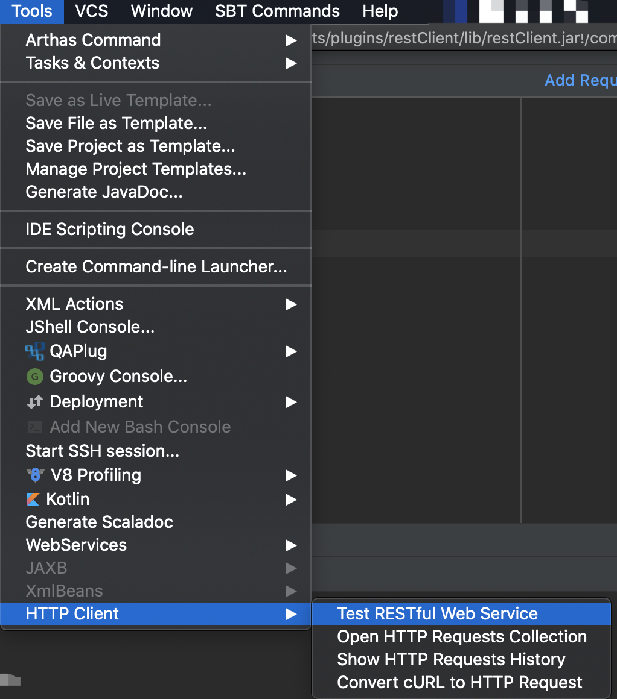
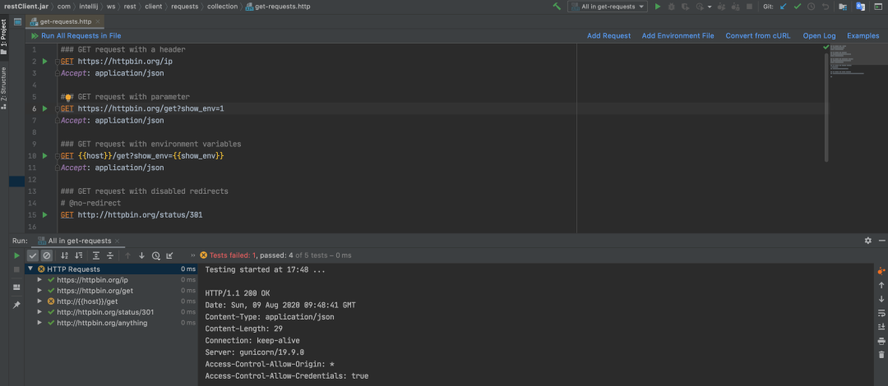

# **常用** IDEA 插件及使用技巧

IDEA 是面向 Java 开发的专业 IDE（集成开发环境），是 JetBrains 公司提供一系列功能强大、风格统一的开发工具，深受开发者喜爱。

## 常用插件

1. AiXcoder Code Completer

代码提示补全插件。使用 AI 去自动提示和补全代码，比 IDEA 自带的代码补全更加智能化。

地址：https://plugins.jetbrains.com/plugin/13574-aixcoder-code-completer/

2. Auto filling Java call arguments

代码生成插件。通过快捷键自动补全函数的调用参数，针对包含大量参数的构造函数和方法非常有用！

地址：https://plugins.jetbrains.com/plugin/8638-auto-filling-java-call-arguments/

3. GitToolBox

Git 增强插件。在自带的 Git 功能之上，新增了查看 Git 状态、自动拉取代码、提交通知等功能。最好用的是可以查看到每一行代码的最近一次提交信息。

地址：https://plugins.jetbrains.com/plugin/7499-gittoolbox/

4. Translation

翻译插件。程序员最痛苦的事莫过于阅读代码时遇到不懂的英文单词，有了这个插件，鼠标选中文本，点击右键即可自动翻译成多国语言。

地址：https://plugins.jetbrains.com/plugin/8579-translation/

##  使用技巧

1. 使用内置 HTTP Client 测试接口

不需要再使用 Postman 等外置接口测试工具了，IDEA 内置了 HTTP Client，通过编写请求脚本来进行调用，非常灵活。

在顶部菜单的 Tools > HTTP Client 中打开：

编写脚本进行 HTTP 接口测试：

详细用法请阅读官方使用文档，地址：https://www.jetbrains.com/help/idea/http-client-in-product-code-editor.html